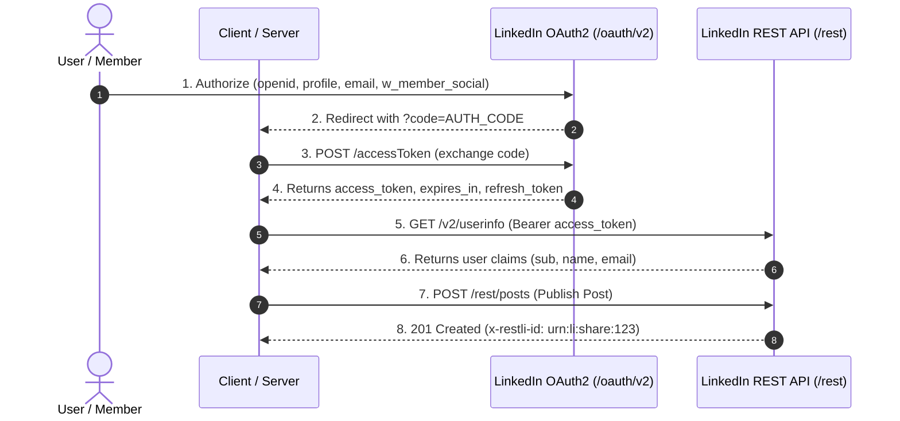

# LinkedIn API Developer Guide & API Collection

This guide provides a comprehensive developer reference for integrating the **Sign In with LinkedIn (OpenID Connect)** and **Share on LinkedIn (REST Posts & Media APIs)** products within your applications and servers.

---

## Table of Contents
1. [Supported Products & Scopes](#supported-products--scopes)
2. [Importing the Collection (Postman & Hoppscotch)](#importing-the-collection-postman--hoppscotch)
3. [Environment Variables Reference](#environment-variables-reference)
4. [Authentication & OAuth 2.0 Flow](#authentication--oauth-20-flow)
5. [Sign In with LinkedIn (OpenID Connect)](#sign-in-with-linkedin-openid-connect)
6. [Share on LinkedIn (REST Posts API)](#share-on-linkedin-rest-posts-api)
7. [Media Upload Workflows (Images, Videos, PDFs)](#media-upload-workflows-images-videos-pdfs)
8. [Company / Organization Page Sharing](#company--organization-page-sharing)
9. [Error Codes & Troubleshooting](#error-codes--troubleshooting)

---

## 1. Supported Products & Scopes

From your [LinkedIn Developer Portal](https://www.linkedin.com/developers/apps/264406530/products), ensure the following products are added to your application:

| Product Name | Scopes Granted | Purpose |
| :--- | :--- | :--- |
| **Sign In with LinkedIn using OpenID Connect** | `openid`, `profile`, `email` | User authentication, identity verification, profile name, picture, and email. |
| **Share on LinkedIn** | `w_member_social` | Publishing text, links, images, videos, and carousels to the member's profile. |
| **Community Management API** *(Optional for Pages)* | `w_organization_social` | Publishing posts to LinkedIn Organization (Company) Pages. |

---

## 2. Importing the Collection (Postman & Hoppscotch)

The collection is provided in **Postman v2.1.0 schema**, making it 100% compatible with both Postman and Hoppscotch.

### Files
- **Collection File:** [`postman/LinkedIn_API_Collection.json`](file:///c:/Users/Neptune/Documents/Projects/corelink_server/postman/LinkedIn_API_Collection.json)
- **Environment File:** [`postman/LinkedIn_Environment.json`](file:///c:/Users/Neptune/Documents/Projects/corelink_server/postman/LinkedIn_Environment.json)

---

### In Postman:
1. Open **Postman** -> Click **Import** (top left).
2. Drag and drop both `LinkedIn_API_Collection.json` and `LinkedIn_Environment.json`.
3. In the top right environment dropdown, select **LinkedIn API - Environment**.
4. Test scripts in the collection will **automatically extract and store** tokens, `person_id`, and media URNs as you run requests sequentially!

---

### In Hoppscotch:
1. Open [Hoppscotch](https://hoppscotch.io/).
2. Navigate to **Collections** (left sidebar) -> Click **Import** -> Select **Postman Collection (v2.1)** -> Choose `postman/LinkedIn_API_Collection.json`.
3. Navigate to **Environments** (left sidebar) -> Click **Import** -> Choose `postman/LinkedIn_Environment.json`.
4. Set **LinkedIn API - Environment** as your active environment.

---

## 3. Environment Variables Reference

| Variable | Description | Auto-Populated? |
| :--- | :--- | :--- |
| `{{client_id}}` | Your LinkedIn App Client ID (`77wtiyb9nrkwzr`) | Preset |
| `{{client_secret}}` | Your LinkedIn App Client Secret | Preset |
| `{{redirect_uri}}` | OAuth Redirect URI (`http://localhost:5000/api/auth/linkedin/callback`) | Preset |
| `{{state}}` | Random string protecting against CSRF | Preset |
| `{{linkedin_version}}` | LinkedIn API REST version in `YYYYMM` format (Default: `202401`) | Preset |
| `{{auth_code}}` | Temporary code from browser redirect | Manual input |
| `{{access_token}}` | Bearer token used for all REST requests |  Auto-set by `1.2` |
| `{{refresh_token}}` | Token used to refresh access tokens |  Auto-set by `1.2` |
| `{{person_id}}` | LinkedIn Member ID (`sub` claim) |  Auto-set by `2.1` |
| `{{person_urn}}` | Full author URN (`urn:li:person:{id}`) |  Auto-set by `2.1` |
| `{{organization_id}}` | Numeric ID of your Company/Organization page | Manual input |
| `{{image_upload_url}}` | Temporary signed CDN URL for image upload |  Auto-set by `4.1` |
| `{{image_asset_urn}}` | Image URN (`urn:li:image:...`) |  Auto-set by `4.1` |
| `{{video_upload_url}}` | Temporary signed CDN URL for video upload |  Auto-set by `4.4` |
| `{{video_asset_urn}}` | Video URN (`urn:li:video:...`) |  Auto-set by `4.4` |
| `{{document_upload_url}}`| Signed CDN URL for PDF slide deck upload |  Auto-set by `4.8` |
| `{{document_asset_urn}}` | Document URN (`urn:li:document:...`) |  Auto-set by `4.8` |
| `{{last_post_urn}}` | URN of the most recently published post |  Auto-set by `3.1` |

---

## 4. Authentication & OAuth 2.0 Flow



### Endpoints
1. **Authorization URL (Browser):**
   `GET https://www.linkedin.com/oauth/v2/authorization`
   - Scopes: `openid profile email w_member_social w_organization_social`
2. **Exchange Token:**
   `POST https://www.linkedin.com/oauth/v2/accessToken`
   - Content-Type: `application/x-www-form-urlencoded`
   - Params: `grant_type=authorization_code`, `code={{auth_code}}`, `client_id={{client_id}}`, `client_secret={{client_secret}}`, `redirect_uri={{redirect_uri}}`
3. **Refresh Token:**
   `POST https://www.linkedin.com/oauth/v2/accessToken`
   - Params: `grant_type=refresh_token`, `refresh_token={{refresh_token}}`
4. **Token Introspection:**
   `POST https://www.linkedin.com/oauth/v2/introspectToken`
5. **Token Revocation:**
   `POST https://www.linkedin.com/oauth/v2/revoke`

---

## 5. Sign In with LinkedIn (OpenID Connect)

### Get User Info
- **Method:** `GET`
- **URL:** `https://api.linkedin.com/v2/userinfo`
- **Headers:** `Authorization: Bearer {{access_token}}`
- **Response:**
  ```json
  {
    "sub": "782bbdua",
    "name": "Jane Doe",
    "given_name": "Jane",
    "family_name": "Doe",
    "picture": "https://media.licdn.com/dms/image/...",
    "locale": {
      "country": "US",
      "language": "en"
    },
    "email": "jane.doe@example.com",
    "email_verified": true
  }
  ```
> **Key Value:** `sub` is the unique Member ID used to construct author URNs: `urn:li:person:782bbdua`.

---

## 6. Share on LinkedIn (REST Posts API)

All modern publishing is performed against the `https://api.linkedin.com/rest/posts` endpoint.

### Required Headers:
```http
Authorization: Bearer {{access_token}}
LinkedIn-Version: 202401
X-Restli-Protocol-Version: 2.0.0
Content-Type: application/json
```

---

### 1. Plain Text Post
```json
{
  "author": "urn:li:person:{{person_id}}",
  "commentary": "Excited to launch our new product! #LinkedInAPI #Tech",
  "visibility": "PUBLIC",
  "distribution": {
    "feedDistribution": "MAIN_FEED",
    "targetEntities": [],
    "thirdPartyDistributionChannels": []
  },
  "lifecycleState": "PUBLISHED",
  "isReshareDisabledByAuthor": false
}
```

---

### 2. Article / Link Share Post
```json
{
  "author": "urn:li:person:{{person_id}}",
  "commentary": "Read our latest article on backend engineering:",
  "visibility": "PUBLIC",
  "distribution": {
    "feedDistribution": "MAIN_FEED",
    "targetEntities": [],
    "thirdPartyDistributionChannels": []
  },
  "content": {
    "article": {
      "source": "https://github.com/ronaldgosso/corelink_server",
      "title": "Corelink Server - LinkedIn API Integration",
      "description": "Backend service for LinkedIn posting and scheduling."
    }
  },
  "lifecycleState": "PUBLISHED"
}
```

---

## 7. Media Upload Workflows (Images, Videos, PDFs)

Media uploads on LinkedIn follow an asynchronous 3-step protocol:

```text
Step 1: Initialize Upload -> Step 2: Upload Binary to CDN -> Step 3: Publish Post with Asset URN
```

###  Image Upload Protocol
1. **Initialize:** `POST https://api.linkedin.com/rest/images?action=initializeUpload`
   ```json
   {
     "initializeUploadRequest": {
       "owner": "urn:li:person:{{person_id}}"
     }
   }
   ```
   *Returns `uploadUrl` and `image` URN (`urn:li:image:...`).*
2. **Upload Binary:** `PUT {{uploadUrl}}` with raw image binary payload (`image/png` or `image/jpeg`).
3. **Publish Post:** `POST https://api.linkedin.com/rest/posts`
   ```json
   {
     "author": "urn:li:person:{{person_id}}",
     "commentary": "Check out this visual architecture:",
     "visibility": "PUBLIC",
     "distribution": { "feedDistribution": "MAIN_FEED" },
     "content": {
       "media": {
         "title": "Architecture Overview",
         "id": "{{image_asset_urn}}"
       }
     },
     "lifecycleState": "PUBLISHED"
   }
   ```

---

###  Video Upload Protocol
1. **Initialize:** `POST https://api.linkedin.com/rest/videos?action=initializeUpload`
   ```json
   {
     "initializeUploadRequest": {
       "owner": "urn:li:person:{{person_id}}",
       "fileSizeBytes": 5242880,
       "uploadCaptions": false,
       "uploadThumbnail": false
     }
   }
   ```
2. **Upload Binary:** `PUT {{video_upload_url}}` with `Content-Type: application/octet-stream`.
3. **Finalize:** `POST https://api.linkedin.com/rest/videos?action=finalizeUpload`
   ```json
   {
     "finalizeUploadRequest": {
       "video": "{{video_asset_urn}}",
       "uploadToken": ""
     }
   }
   ```
4. **Publish Post:** `POST https://api.linkedin.com/rest/posts` referencing `{{video_asset_urn}}`.

---

###  Document (PDF Carousel) Upload Protocol
1. **Initialize:** `POST https://api.linkedin.com/rest/documents?action=initializeUpload`
2. **Upload Binary:** `PUT {{document_upload_url}}` with `Content-Type: application/pdf`.
3. **Publish Post:** `POST https://api.linkedin.com/rest/posts` referencing `{{document_asset_urn}}`.

---

## 8. Company / Organization Page Sharing

To post on behalf of a company page:
1. Ensure your LinkedIn account has **Super Admin** or **Content Admin** role on the LinkedIn Company Page.
2. In the post request body, change the `author` field from `urn:li:person:{id}` to `urn:li:organization:{id}`:
   ```json
   {
     "author": "urn:li:organization:12345678",
     "commentary": "Announcing our company update!",
     "visibility": "PUBLIC",
     "distribution": { "feedDistribution": "MAIN_FEED" },
     "lifecycleState": "PUBLISHED"
   }
   ```

---

## 9. Error Codes & Troubleshooting

| HTTP Status | Error Reason | Solution |
| :--- | :--- | :--- |
| `400 Bad Request` | Missing required fields or malformed URN | Verify author format (`urn:li:person:...` or `urn:li:organization:...`). |
| `401 Unauthorized` | Invalid, revoked, or expired access token | Run `1.3 Refresh Access Token` or re-authenticate through `1.1` and `1.2`. |
| `403 Forbidden` | Missing required scope permissions | Ensure your token was granted `w_member_social` (for profile) or `w_organization_social` (for pages). |
| `422 Unprocessable` | Media asset is still processing or failed validation | Ensure binary upload completed and wait 2–5 seconds for CDN virus scan before publishing post. |

---

##  Official LinkedIn Resources
- [LinkedIn REST Posts API Documentation](https://learn.microsoft.com/en-us/linkedin/marketing/community-management/shares/posts-api)
- [Sign In with LinkedIn (OIDC) Documentation](https://learn.microsoft.com/en-us/linkedin/consumer/integrations/self-serve/sign-in-with-linkedin-v2)
- [Images & Media Upload API Guide](https://learn.microsoft.com/en-us/linkedin/marketing/community-management/shares/images-api)
