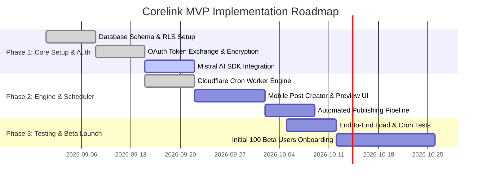

# Corelink — LinkedIn AI Post Scheduler
## Master Project Specification & Design Documentation
*Version 1.0.0 — Comprehensive Engineering, UI/UX Design & Architecture Guide*

---

## 📑 Table of Contents
1. [Executive Summary & Product Vision](#1-executive-summary--product-vision)
2. [High-Level System Architecture](#2-high-level-system-architecture)
3. [The Layman's Guide (How Corelink Works)](#3-the-laymans-guide-how-corelink-works)
4. [Mobile Application Specification (UI/UX)](#4-mobile-application-specification-uiux)
5. [Web Application Dashboard Specification](#5-web-application-dashboard-specification)
6. [Centralized Backend Architecture (`corelink_server`)](#6-centralized-backend-architecture-corelink_server)
7. [AI Post Generation Engine (Mistral AI)](#7-ai-post-generation-engine-mistral-ai)
8. [Database, Security & Data Isolation (Supabase)](#8-database-security--data-isolation-supabase)
9. [Edge Cron & Publishing Pipeline (Cloudflare Worker)](#9-edge-cron--publishing-pipeline-cloudflare-worker)
10. [Design System & UI Guidelines](#10-design-system--ui-guidelines)
11. [Roadmap & Phased Rollout Plan](#11-roadmap--phased-rollout-plan)

---

## 1. Executive Summary & Product Vision

### 🎯 The Problem
Consistency on LinkedIn drives professional growth, leads, and brand authority. However, maintaining a consistent posting cadence is difficult:
- **Writer's Block**: Coming up with high-converting hooks and structured posts daily is exhausting.
- **Manual Overhead**: Scheduling posts through LinkedIn’s native tools is clunky and lacks intelligent drafting.
- **Security & Privacy Concerns**: Sharing `.env` files or API secrets insecurely across teams causes data leakage and token expiration issues.

### 💡 The Solution: Corelink
**Corelink** is a zero-cost, high-velocity LinkedIn content engine that combines:
1. **AI-Powered Hook & Post Generation** (powered by Mistral AI).
2. **Mobile & Web Multi-Platform Content Schedulers** (Flutter/React Native & Web).
3. **Automated Serverless Publishing Pipeline** (Vercel Node.js Gateway + Cloudflare Edge Crons + Supabase PostgreSQL).

---

## 2. High-Level System Architecture


### 🏗️ Complete Technology Stack Matrix

| Component | Technology | Purpose |
| :--- | :--- | :--- |
| **Mobile App** | Flutter / React Native | Native mobile post creator, interactive calendar & draft manager |
| **Web App** | React / Next.js | Desktop Kanban queue, team analytics, and bulk post manager |
| **Backend Gateway** | Node.js (ES Modules, Express 5) on Vercel | Centralized API for validation, token encryption, AI, and publishing |
| **Database & Auth** | Supabase (PostgreSQL + RLS) | Secure relational store for profiles, encrypted tokens, and posts |
| **AI Brain** | Mistral AI SDK (`mistral-small` / `mistral-large`) | Viral hook generator, tone adaptation, and post structuring |
| **Edge Cron Engine** | Cloudflare Workers (`*/10 * * * *`) | Serverless cron trigger polling due posts with <10ms CPU time |
| **Social API** | LinkedIn REST API (`/rest/posts`) | Official OAuth 2.0 OpenID Connect & multi-media post publishing |
| **Secret Management** | Infisical CLI | Team secret synchronization and zero-plaintext runtime injection |

---

## 3. The Layman's Guide (How Corelink Works)

> ### 🍕 The Restaurant Analogy
> Imagine running a world-class restaurant:
> 
> 1. **The Recipe & Menu (Mistral AI)**: You tell the AI chef your topic idea (*"Why serverless wins in 2026"*). The AI chef creates a structured, delicious dish (an engaging LinkedIn post with a viral hook, formatted spacing, and hashtags).
> 2. **The Order Book (Supabase Database)**: You review the dish on your phone, make edits, and pick a delivery time (*"Tomorrow at 9:00 AM"*). The order is safely stored in our private vault.
> 3. **The Automated Alarm (Cloudflare Worker Cron)**: Every 10 minutes, a fast edge timer rings and asks: *"Is any order due right now?"*
> 4. **The Courier (Vercel Backend Server)**: If an order is due, the server unlocks the user's secure LinkedIn badge (AES-256 encrypted token) and delivers the post straight to LinkedIn.
> 5. **The Feedback (Mobile Realtime)**: Your mobile screen instantly turns green: **"Published! 🚀"**.

---

## 4. Mobile Application Specification (UI/UX)


### 📱 Core Mobile Screens & User Flows

#### Screen 1: One-Tap LinkedIn OAuth Login
- Clean minimal splash screen with **"Sign in with LinkedIn"** branded OAuth button.
- Handles authorization code redirect and immediately transitions to the home feed.

#### Screen 2: AI Post Creator Studio
- **Topic Input Box**: *"Enter topic, article link, or rough notes..."*
- **Tone Pill Selector**: `Professional`, `Engaging`, `Storytelling`, `Contrarian`, `Authoritative`.
- **Hook Length Slider**: `Short`, `Medium`, `Punchy`.
- **"Magic Generate" Button**: Animates while Mistral AI streams the generated post.

#### Screen 3: Post Editor & Live Preview Card
- WYSIWYG text area with character counters and formatting shortcuts (Double spacing, bullet points).
- **Live LinkedIn Preview**: Simulates how the post will look in the LinkedIn feed, showing where the *"…see more"* cutoff occurs.
- **Media Picker**: Attach single images, multi-image carousels, videos, or PDF slide decks.

#### Screen 4: Interactive Schedule Calendar & Queue
- **Weekly & Monthly View**: Visual calendar grid with chips indicating scheduled posts.
- **Status Badges**:
  - 🟡 `Pending`: Waiting for scheduled timestamp.
  - 🔵 `Processing`: Currently uploading to LinkedIn CDN.
  - 🟢 `Published`: Successfully live on LinkedIn feed.
  - 🔴 `Failed`: Error recorded with retry button.

---

## 5. Web Application Dashboard Specification


### 🖥️ Desktop Web Features for Founders & Power Users

1. **Top Metric Cards**:
   - Total Post Impressions (`+34% MoM`)
   - Scheduled Posts in Queue (`18 pending`)
   - Average Engagement Rate (`5.8%`)
   - Next Scheduled Execution (`Today at 9:15 AM EST`)
2. **Kanban Schedule Board**:
   - Drag-and-drop cards between days to effortlessly reschedule posts.
   - Filter by status (`Published`, `Pending`, `AI Generated`, `Drafts`).
3. **AI Hook Optimization Lab**:
   - Paste any drafted sentence to instantly generate 3 high-converting hook variants.
4. **Multi-Account & Organization Page Switcher**:
   - Toggle between personal member profile posting and LinkedIn Company Pages (`urn:li:organization:...`).

---

## 6. Centralized Backend Architecture (`corelink_server`)

All requests from mobile and web apps are routed through `corelink_server`.

```
┌─────────────────────────────────────────────────────────┐
│              corelink_server (Central Gateway)          │
│                                                         │
│  • Validation & Auth Middleware                         │
│  • AES-256 Token Encryption/Decryption                  │
│  • Mistral AI Prompt Engineering                        │
│  • Business Logic & Idempotent Post Claiming            │
└───┬────────────────────────┬────────────────────────┬───┘
    │                        │                        │
    ▼                        ▼                        ▼
┌─────────────────┐  ┌───────────────┐  ┌──────────────────┐
│    Supabase     │  │  Mistral AI   │  │   LinkedIn REST  │
│ (PostgreSQL/RLS)│  │ (mistral-small│  │    (Posts API)   │
└─────────────────┘  └───────────────┘  └──────────────────┘
```

### 📡 API Route Directory

| Endpoint | Method | Purpose | Authentication |
| :--- | :---: | :--- | :--- |
| `/api/health` | `GET` | Health status and uptime | None |
| `/api/auth/linkedin` | `POST` | Exchanges LinkedIn OAuth code, encrypts token, upserts profile | None |
| `/api/auth/me` | `GET` | Get authenticated user profile & LinkedIn status | Bearer JWT |
| `/api/auth/disconnect` | `POST` | Revoke LinkedIn access & remove credentials | Bearer JWT |
| `/api/generate` | `POST` | Generate LinkedIn post with Mistral AI | Bearer JWT |
| `/api/generate/optimize-hook`| `POST` | Optimize opening hooks for maximum engagement | Bearer JWT |
| `/api/posts` | `POST` | Create a new scheduled post or draft in Supabase | Bearer JWT |
| `/api/posts` | `GET` | List user's posts with status filter and pagination | Bearer JWT |
| `/api/posts/:id` | `GET` | Get single post details and execution logs | Bearer JWT |
| `/api/posts/:id` | `PUT` | Update post content or reschedule time | Bearer JWT |
| `/api/posts/:id` | `DELETE`| Delete / cancel scheduled post | Bearer JWT |
| `/api/posts/stats` | `GET` | Summary statistics (pending, published, failed counts) | Bearer JWT |
| `/api/publish` | `POST` | Cloudflare Worker cron trigger to claim & publish due posts | Bearer `CRON_SECRET` |
| `/api/posts/:id/publish-now` | `POST` | User-initiated immediate publishing | Bearer JWT |

---

## 7. AI Post Generation Engine (Mistral AI)

Corelink uses **Mistral AI (`mistral-small-latest`)** configured with LinkedIn algorithmic heuristics:

### 🧠 Prompt Engineering Principles
1. **Hook Formula (Lines 1–2)**:
   - Must stop the scroll before the *"…see more"* button.
   - Uses contrarian insights, bold statistics, or provocative questions.
2. **Readability & Formatting**:
   - Double line-breaks between every thought.
   - Max 1–2 sentences per paragraph to optimize mobile readability.
3. **Actionable Takeaways**:
   - Numbered or bulleted insights.
4. **Hashtag & Engagement Strategy**:
   - 3–5 targeted professional hashtags at the bottom.
   - A concluding question inviting comments to boost algorithmic reach.

---

## 8. Database, Security & Data Isolation (Supabase)

### 🗄️ Relational Schema
- **`public.profiles`**: Contains user info and **AES-256-GCM encrypted tokens** (`encrypted_access_token`).
- **`public.posts`**: Stores drafts, schedules, status (`pending`, `processing`, `published`, `failed`), and error logs.
- **`public.ai_generation_logs`**: Tracks prompt topics and model usage.

### 🔒 Security Guardrails
- **Row Level Security (RLS)**: Enforces that mobile clients can only access rows matching `auth.uid() = user_id`.
- **Service Role Isolation**: Backend connects via `SUPABASE_SERVICE_ROLE_KEY` exclusively on the server to decrypt tokens and manage background jobs.
- **Atomic Locking Procedure**:
  ```sql
  -- Stored Procedure: public.claim_due_posts(batch_limit)
  -- Uses FOR UPDATE SKIP LOCKED to guarantee ZERO race conditions across concurrent crons.
  ```

---

## 9. Edge Cron & Publishing Pipeline (Cloudflare Worker)

```
[ Cloudflare Worker Edge (Cron */10 * * * *) ]
       │
       │ (1. Dispatches with CRON_SECRET)
       ▼
[ Vercel Serverless /api/publish ]
       │
       │ (2. Atomic Claim: status -> 'processing')
       ▼
[ Supabase PostgreSQL (idx_posts_poll <5ms) ]
       │
       │ (3. Decrypts LinkedIn Access Token)
       ▼
[ LinkedIn REST Posts API (https://api.linkedin.com/rest/posts) ]
       │
       │ (4. Success: status -> 'published', x-restli-id saved)
       ▼
[ Supabase Realtime Broadcasts to Mobile Client ]
```

- **Cron Cadence**: Runs every **10 minutes** (`*/10 * * * *`).
- **Sub-10ms CPU**: Offloads all heavy processing asynchronously to Vercel.
- **Exponential Backoff**: Automatically retries on temporary network failures.

---

## 10. Design System & UI Guidelines

For UI/UX Designers working on Flutter, React Native, or Web:

### 🎨 Color Tokens (Dark Mode Default)

| Token Name | Hex Value | Visual Usage |
| :--- | :--- | :--- |
| **`Background Base`** | `#0B0F19` | Deep charcoal primary background |
| **`Card Surface`** | `#131B2E` | Glassmorphism card surfaces |
| **`Card Border`** | `rgba(255, 255, 255, 0.08)` | Subtle 1px crisp borders |
| **`Primary Accent`** | `#00D2FF` | Electric Cyan (Call-to-action buttons, active tabs) |
| **`Secondary Accent`**| `#7928CA` | Royal Violet (AI generation highlights) |
| **`Success (Published)`**| `#10B981` | Emerald Green status pills |
| **`Warning (Pending)`**| `#F59E0B` | Amber status pills |
| **`Error (Failed)`** | `#EF4444` | Coral Red error alerts |

### 🔤 Typography
- **Primary Typeface**: `Inter`, `SF Pro Display` (iOS), or `Roboto` (Android).
- **Headings**: Semi-bold (600), `-0.02em` letter spacing.
- **Body Text**: Regular (400), `1.6` line-height for readability.

---

## 11. Roadmap & Phased Rollout Plan



---

## 📄 Ready for PDF Export
This document is formatted with standard GitHub Flavored Markdown and self-contained vector-quality images. You can convert it directly to PDF using:
- **VS Code**: `Markdown PDF: Export (pdf)`
- **CLI**: `npx md-to-pdf PROJECT_DOCUMENTATION.md`
- **Pandoc**: `pandoc PROJECT_DOCUMENTATION.md -o Corelink_Documentation.pdf --pdf-engine=wkhtmltopdf`
